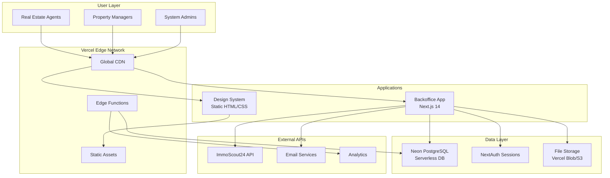
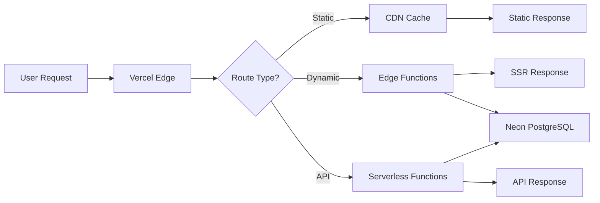
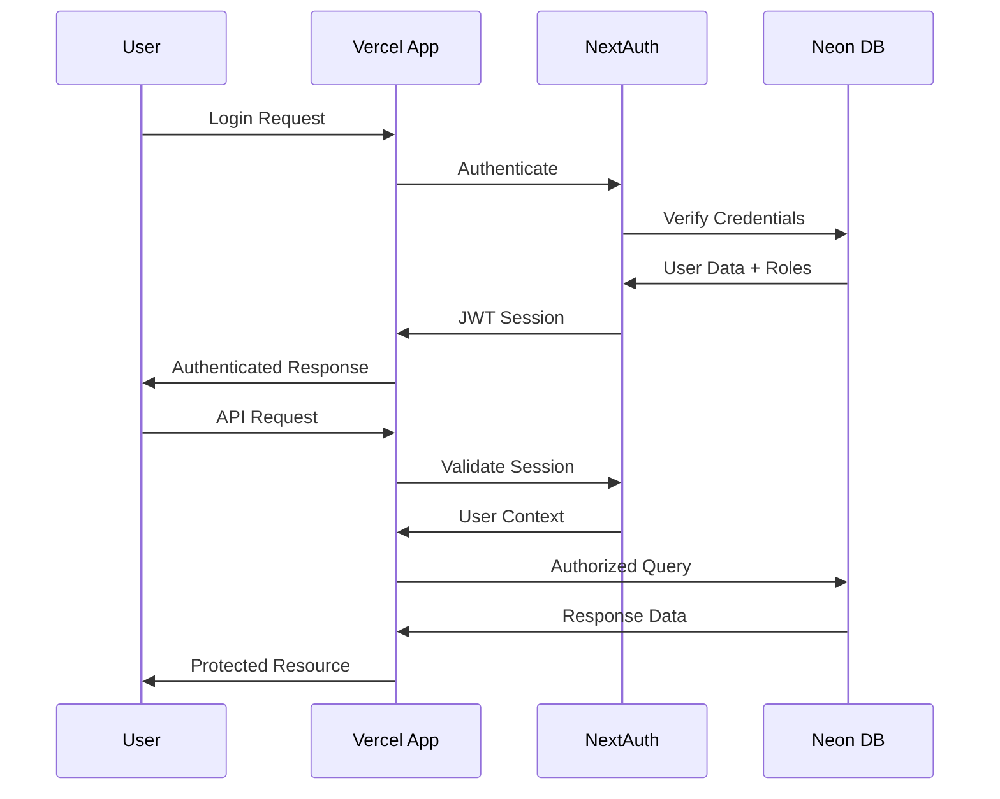
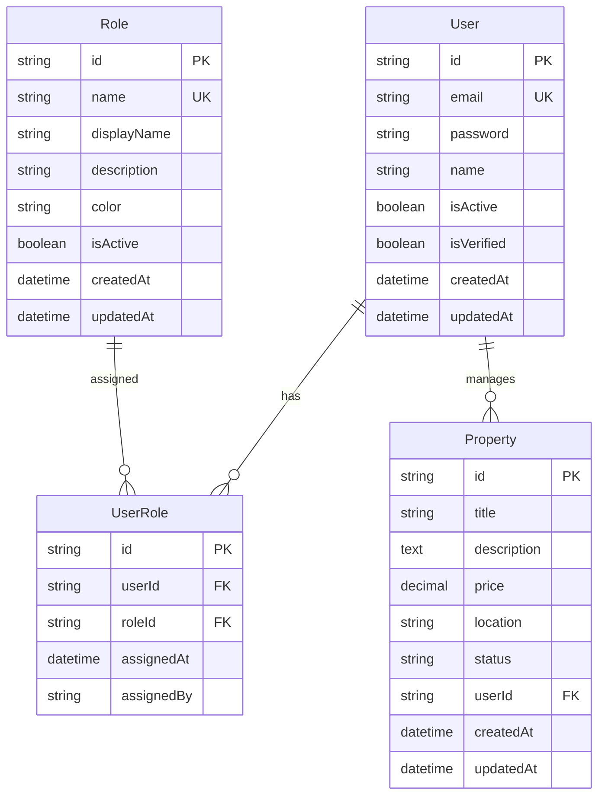
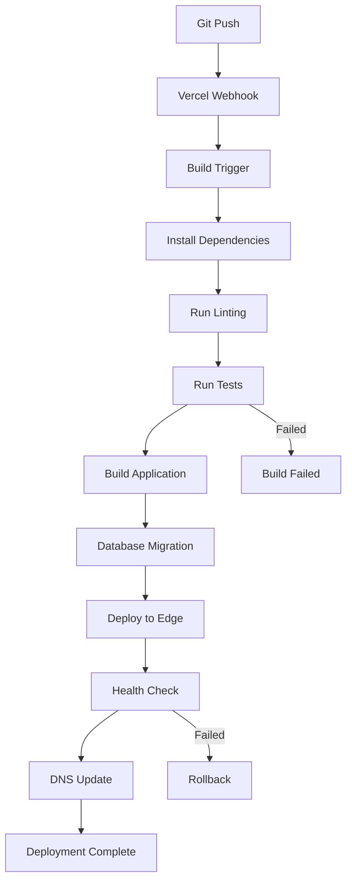

# 🏗️ **Live Your Dreams - Vercel Architecture**

> **Moderne Serverless-Architektur für Premium Real Estate Platform**

---

## 🎯 **System Overview**



---

## 🚀 **Application Architecture**

### **1. Backoffice Application**
**URL:** `backoffice.liveyourdreams.online`
**Tech Stack:** Next.js 14 (App Router) + TypeScript

```
apps/backoffice/
├── app/                        # Next.js App Router
│   ├── (auth)/                # Auth Routes
│   │   ├── login/             # Login Page
│   │   └── register/          # Registration  
│   ├── admin/                 # Admin Panel
│   │   ├── users/             # User Management
│   │   └── roles/             # Role Management
│   ├── dashboard/             # Main Dashboard
│   ├── properties/            # Property Management
│   ├── leads/                 # Lead Management
│   └── api/                   # API Routes
│       ├── auth/              # Authentication
│       ├── users/             # User CRUD
│       ├── roles/             # Role CRUD
│       └── properties/        # Property CRUD
├── components/                # React Components
│   ├── ui/                    # UI Components
│   ├── forms/                 # Form Components
│   └── layout/                # Layout Components
├── lib/                       # Utilities
│   ├── auth/                  # NextAuth Config
│   ├── db/                    # Prisma Client
│   └── utils/                 # Helper Functions
└── public/                    # Static Assets
    ├── master.css             # Design System CSS
    └── images/                # Image Assets
```

### **2. Design System**
**URL:** `designsystem.liveyourdreams.online`
**Tech Stack:** Static HTML/CSS/JS

```
design-system/v2/
├── components/                # Component Documentation
│   ├── button/               # Button Components
│   ├── input/                # Input Components
│   ├── table/                # Table Components
│   ├── modal/                # Modal Components
│   ├── toast/                # Toast Components
│   ├── spinner/              # Loading Spinners
│   └── overview/             # Component Overview
├── design-principles/        # Design Guidelines
│   ├── colors/               # Color System
│   ├── typography/           # Typography
│   ├── grid/                 # Layout Grid
│   └── spacing/              # Spacing System
├── shared/                   # Shared Assets
│   ├── master.css            # Core CSS
│   ├── components.css        # Component Styles
│   └── utilities.css         # Utility Classes
└── patterns/                 # UI Patterns
    ├── forms/                # Form Patterns
    ├── navigation/           # Navigation Patterns
    └── data-display/         # Data Display
```

---

## ⚡ **Performance Architecture**

### **Edge Computing Stack:**



### **Caching Strategy:**
- **Static Assets:** CDN Cache (1 Jahr)
- **Design System:** Edge Cache (1 Stunde)
- **API Responses:** SWR/TanStack Query (5 Minuten)
- **Database:** Connection Pooling (Neon)

### **Performance Targets:**
- **First Contentful Paint:** < 1.5s
- **Largest Contentful Paint:** < 2.5s
- **Time to Interactive:** < 3s
- **Cumulative Layout Shift:** < 0.1
- **API Response Time:** < 200ms

---

## 🔒 **Security Architecture**

### **Authentication Flow:**



### **Security Layers:**
- **Transport:** HTTPS (TLS 1.3)
- **Session:** NextAuth JWT + Secure Cookies
- **Database:** SSL Connections + Row-Level Security
- **API:** RBAC (Role-Based Access Control)
- **Edge:** DDoS Protection + Rate Limiting
- **Headers:** CSP, HSTS, X-Frame-Options

### **Authorization Patterns:**
```typescript
// RBAC Implementation
export async function enforcePermission(
  session: Session | null,
  permission: Permission
): Promise<void> {
  if (!session?.user?.permissions?.includes(permission)) {
    throw new Error('Insufficient permissions');
  }
}

// Usage in API Routes
export async function GET(request: Request) {
  const session = await auth();
  await enforcePermission(session, 'users.read');
  
  // Protected logic...
}
```

---

## 📊 **Data Architecture**

### **Database Schema (Simplified):**



### **Data Flow Patterns:**

**1. Optimistic Updates:**
```typescript
// UI zeigt Änderung sofort, API Call im Hintergrund
const { mutate } = useSWRMutation('/api/users', updateUser, {
  optimisticData: updatedUser,
  rollbackOnError: true,
});
```

**2. Server-State Management:**
```typescript
// TanStack Query für Server State
const { data: users, isLoading } = useQuery({
  queryKey: ['users', filters],
  queryFn: () => fetchUsers(filters),
  staleTime: 5 * 60 * 1000, // 5 Minuten
});
```

**3. Real-time Updates:**
```typescript
// WebSocket-ähnliches Verhalten via Server-Sent Events
useEffect(() => {
  const eventSource = new EventSource('/api/events');
  eventSource.onmessage = (event) => {
    // Update UI with real-time data
    queryClient.invalidateQueries(['users']);
  };
}, []);
```

---

## 🔄 **Deployment Pipeline**

### **CI/CD Workflow:**



### **Environment Management:**
- **Development:** `localhost:3000`
- **Preview:** Automatic per-PR deployments
- **Production:** `backoffice.liveyourdreams.online`

### **Rollback Strategy:**
```bash
# Instant Rollback via Vercel
vercel rollback https://backoffice.liveyourdreams.online

# Database Rollback (falls nötig)
npx prisma migrate reset
npx prisma migrate deploy
```

---

## 📈 **Scalability & Monitoring**

### **Auto-Scaling:**
- **Serverless Functions:** Auto-scale 0→∞
- **Database:** Neon Auto-scaling (0.25-8 vCPU)
- **CDN:** Global Edge Network
- **Storage:** Unlimited via Vercel Blob

### **Monitoring Stack:**
```typescript
// Performance Monitoring
import { Analytics } from '@vercel/analytics';
import { SpeedInsights } from '@vercel/speed-insights';

// Error Tracking
import { Sentry } from '@sentry/nextjs';

// Custom Metrics
export function trackUserAction(action: string, properties?: object) {
  Analytics.track(action, properties);
}
```

### **Key Metrics:**
- **User Actions:** Login, CRUD Operations, Search
- **Performance:** Page Load Times, API Response Times
- **Errors:** 4xx/5xx Responses, JavaScript Errors
- **Business:** Daily Active Users, Feature Adoption

---

## 🔧 **Development Workflow**

### **Local Development:**
```bash
# Setup
git clone https://github.com/christianbernecker/live-your-dreams.git
cd live-your-dreams/apps/backoffice
npm install

# Environment
cp .env.example .env.local
# Fill DATABASE_URL, NEXTAUTH_SECRET, etc.

# Development
npm run dev          # Start dev server
npm run db:migrate   # Run migrations
npm run db:seed      # Seed database
npm run lint         # Code linting
npm run test         # Run tests
```

### **Feature Development:**
```bash
# Feature Branch
git checkout -b feat/new-feature

# Development
npm run dev
# Code changes...

# Testing
npm run test
npm run e2e

# Deployment (Auto via Vercel)
git push origin feat/new-feature
# → Vercel creates preview deployment

# Production
git checkout main
git merge feat/new-feature
git push origin main
# → Vercel deploys to production
```

---

## 🎯 **Success Metrics**

### **Technical KPIs:**
- **Uptime:** > 99.9%
- **Response Time:** < 200ms (95th percentile)
- **Error Rate:** < 0.1%
- **Build Time:** < 2 minutes
- **Deployment Frequency:** Multiple times per day

### **Business KPIs:**
- **Page Load Speed:** < 3s
- **User Satisfaction:** > 4.5/5 
- **Feature Adoption:** > 80%
- **Support Tickets:** < 5/month

### **Security KPIs:**
- **Vulnerability Score:** 0 Critical
- **SSL Rating:** A+
- **Security Headers:** 100% Score
- **Authentication Success:** > 99%

---

## 🚀 **Future Architecture**

### **Planned Enhancements:**
- **Edge API Routes:** Distribute API endpoints globally
- **Database Sharding:** Multi-region Neon setup
- **Real-time Features:** WebSocket support via Pusher
- **Advanced Caching:** Redis for session storage
- **Microservices:** Split large features into separate services

### **Scalability Roadmap:**
1. **Phase 1:** Current architecture (0-1k users)
2. **Phase 2:** Edge optimization (1k-10k users)
3. **Phase 3:** Multi-region deployment (10k+ users)
4. **Phase 4:** Microservices architecture (Enterprise)

---

*Aktualisiert: September 2025 | Vercel-Native Serverless Architecture*
